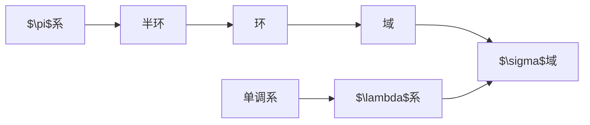

# 可测空间与可测映射

## 集合其运算

指示函数：将空间$X$上定义的实函数
$$ I_{A}(x)=\begin{cases}
1 \quad  x \in A \\
0 \quad  x \notin A
\end{cases} $$
称为集合$A$的指示函数

$A$的余：
$$ A^{\complement} := \{ x:x \notin A \}$$

$A$与$B$的并：
$$ A \cup B := \{ x:(x \in A)\vee(x \in B) \}$$

$A$与$B$的交：
$$ A \cap B := \{ x:(x \in A)\wedge(x \in B) \}$$

差：
$$ A \setminus B := \{ x:(x \in A)\vee(x \notin B) \}$$

对称差：
$$A \bigtriangleup B := (A \setminus B)\cup(B\setminus A) = \{ x : (x \in A\cup B)\wedge(x \notin A\cap B) \}$$

若$B \subseteq A$

## 集合系

### 常见集合系

记实数域上由左半轴全体组成的集合系为
$$ \mathscr{P}_{\mathbb{R}} := \{ (-\infty,a]:a \in \mathbb{R} \} $$

记实数域上由左开右闭区间全体组成的集合系为
$$ \mathscr{Q}_{\mathbb{R}} := \{ (a,b]:a,b \in \mathbb{R} \} $$

单调系：如果对集合系$\mathscr{M}$中的任何单调序列${A_{n},n=1,2, …}$均有 $\lim_{ n \to \infty }A_{n} \in \mathscr{M}$，则称$\mathscr{M}$为单调系。

$\lambda$系：
若集合系$\mathscr{L}$满足：

- $X \in \mathscr{L}$
- $A,B \in \mathscr{L}$且$B \subseteq A \implies A\setminus B \in \mathscr{L}$
- $A_n \in \mathscr{L}$且$A_n \uparrow \implies A_n \in \mathscr{L}$

$$ A^{\complement}=X \setminus A \in \mathscr{L} $$

$\sigma$域：
若集合系$\mathscr{F}$满足：

- $X \in \mathscr{F}$
- $A \in \mathscr{F} \implies A^{\complement} \in \mathscr{F}$
- $A_n \in \mathscr{F} \implies \bigcup_{n=1}^{\infty} A_n \in \mathscr{F}$

例：
最小的$\sigma$域：$\{ X,\emptyset \}$

### 集合系间的关系

$\sigma$域是域

设$\mathscr{F}$是一个$\sigma$域，则其对补运算封闭。再由其对可列并封闭可得
$$ A_{n} \in m\mathscr{F} \implies \bigcap_{n=1}^{\infty}=\{ \bigcup_{n=1}^{\infty} A_{n}^{\complement} \}^{\complement} \in \mathscr{F} $$
故$\sigma$域对可列交也是封闭的。由于$X \in \mathscr{F}$，故：
$$ A,B \in \mathscr{F} \implies A \cap B = A \cap B \cap X \cap \cdots \in \mathscr{F} $$
即其对交运算封闭。综上，$\sigma$域是域。

$\lambda$系是单调系；$\sigma$域是$\lambda$系。

设$\mathscr{L}$是$\lambda$系，$\{ A_n \in \mathscr{L} \}$为单调集合。若$A_n \uparrow$，则由$\lambda$系的性质三可得
$$\lim_{ n \to \infty }A_n = \bigcup_{n=1}^{\infty} A_n \in \mathscr{L}$$
若$A_n \downarrow$，则
$$\lim_{ n \to \infty }A_n = \bigcap_{n=1}^{\infty} A_n = \{ \bigcup_{n=1}^{\infty} A_{n}^{\complement} \}^{\complement} \in \mathscr{L}$$
综上，$\lambda$系是单调系。

设$\mathscr{F}$是$\sigma$域，$A,B \in \mathscr{F}$且$B \subseteq A$。易知$\sigma$域满足$\lambda$系的性质一与性质三。又因为
$$A \setminus B = A \cap B^{\complement}=\{ A ^{\complement} \cup B \}^{\complement} \in \mathscr{F}$$
故，$\sigma$域是$\lambda$系。

总结以上的讨论，我们得到了所定义的七个集合系之间由宽松到严紧的下列顺序：

|             |    交    |       并       |          差          |     补      |    空间     |    极限     |
|:-----------:|:--------:|:--------------:|:--------------------:|:-----------:|:-----------:|:-----------:|
|   $\pi$系   | ==有限== |                |                      |             |             |             |
|    半环     | ==有限== |                | ==真差可被有限覆盖== |             |             |             |
|     环      |   有限   |    ==有限==    |     ==$\surd$==      |             |             |             |
|     域      | ==有限== |      有限      |       $\surd$        | ==$\surd$== | ==$\surd$== |             |
|   单调系    |          |                |                      |             |             | ==$\surd$== |
| $\lambda$系 |          | ==非降时可列== |       ==真差==       |   $\surd$   | ==$\surd$== |   $\surd$   |
| $\sigma$域  |   可列   |    ==可列==    |       $\surd$        | ==$\surd$== | ==$\surd$== |   $\surd$   |

这些集合系的核心是$\sigma$域；它的成员就是我们常说的可测集。换旬话说，我们最终是要在$\sigma$域上建立测度。非空集合$X$和它上面的一个$\sigma$域$\mathscr{F}$放在一起写成的$(X,\mathscr{F})$将称为可测空间。

一个既是单调系又是域的集合系必是$\sigma$域。由表格易知，若域满足可列并封闭，则为$\sigma$域。设域$\mathscr{F}$为单调系，则对其中的可列个集合序列$\{ A_n \in \mathscr{F} \}$有：
$$ \begin{align}
 &\bigcup_{k=1}^{n}A_k \in \mathscr{F} ,\ n = 1,2,\cdots  \\
\implies &\bigcup_{n=1}^{\infty} A_n=\bigcup_{n=1}^{\infty} \bigcup_{k=1}^{n}A_k = \lim_{ n \to \infty } \bigcup_{k=1}^{n}A_k \in \mathscr{F}
\end{align} $$
即$\mathscr{F}$可列并运算封闭，故$\mathscr{F}$是$\sigma$域。

一个既是$\lambda$系又是$\pi$系的集合系必是$\sigma$域。

记此集合系为$\mathscr{F}$，由表可知，$\mathscr{F}$为一域。又因为$\lambda$系是单调系，由上一命题可知，$\mathscr{F}$为$\sigma$域。

$\sigma$环：

- $A,B \in \mathscr{R} \implies A\setminus B \in \mathscr{R}$
- $A_n \in \mathscr{R} \implies \bigcup_{n=1}^{\infty} A_n \in \mathscr{F}$

易见：一个对可列并运算封闭的环是$\sigma$环；一个包含$X$的$\sigma$环是$\sigma$域。

## $\sigma$域的生成

$\sigma$域是具有很好性质的集合系（包含全集，补运算封闭，可列并封闭），事实上，其与概率中事件域的定义如出一辙。但是，正因为其有好的性质，我们很难直接地构造出一个$\sigma$域，故更多时候我们用更简单的集合系来**生成** $\sigma$域。考虑更深入的问题：如何由简单的集合系生成复杂的集合系？

生成：
若环（或单调系，或$\lambda$系，$\sigma$域）$\mathscr{S}$与集合系$\mathscr{E}$之间满足关系：

- $\mathscr{E} \subseteq \mathscr{S}$
- 对任意环$\mathscr{S}'$均有
$$ \mathscr{E} \subseteq \mathscr{S}' \in \mathscr{S} \subseteq \mathscr{S}' $$
则称$\mathscr{S}$为$\mathscr{E}$生成的环（或单调系，或$\lambda$系，$\sigma$域），即包含$\mathscr{E}$的最小环（或单调系，或$\lambda$系，$\sigma$域）。

由任意集合系$\mathscr{E}$生成的环，单调系，或$\lambda$系，$\sigma$域均存在。

记$X$中全体集合所组成的集合系为$\mathscr{T}$，故$\mathscr{T}$是一个$\sigma$域。因此$\mathscr{T}$是环（以及单调系，$\lambda$系，$\sigma$域），而且$\mathscr{E} \subseteq \mathscr{T}$。把包含集合系$\mathscr{E}$的环的全体记为$\mathbf{A}$，则$\mathscr{T} \in \mathbf{A}$，因而$\mathbf{A}$非空。令$\mathscr{S}:=\bigcap_{\mathscr{A}\in\mathbf{A}}\mathscr{A}$，则$\mathscr{S}$仍为环（==为什么？？？==）且为最小环。

由集合系$\mathscr{E}$生成的环、单调系、$\lambda$系和$\sigma$域分别记为$r(\mathscr{E}),m(\mathscr{E}),l(\mathscr{E}),\sigma(\mathscr{E})$。

若$\mathscr{Q}$是半环，则
$$ r(\mathscr{Q})=\bigcup_{n=1}^{\infty}\{ \bigcup_{k=1}^{n}A_k : (A_k \in \mathscr{Q})\vee(A_i \cap A_j = \emptyset,\ i\neq j) \} =\bigcup_{n=1}^{\infty}Q_n$$

等式右端的元素为$\bigcup_{k=1}^{n}A_k,A_k \in \mathscr{Q}$，由于$r(\mathscr{Q})$包含$\mathscr{Q}$，故$r(\mathscr{Q})$包含$A_k$。又$r(\mathscr{Q})$为环，对有限并运算封闭，故包含$\bigcup_{k=1}^{n}A_k$，即$\text{右式} \subseteq r(\mathscr{Q})$。

明显，右式包含了$\mathscr{Q}$，若右式是一个环，则其必包含最小环$r(\mathscr{Q})$，即可得证。记右式中的某两个元素为$A,B$，即则存在两两不交的$\{A_i \in \mathscr{Q},\ i=1, \cdots ,n\}$和两两不交的$\{B_j \in \mathscr{Q},\ j=1, \cdots ,m\}$
使
$$ A=\bigcup_{i=1}^{n}A_i ,\quad B=\bigcup_{j=1}^{m}B_j $$
则
$$ \begin{align}
A \setminus B & = A \cap B^{\complement}=\bigcup_{i=1}^{n}(A_i \cap B^{\complement})=\bigcup_{i=1}^{n}(A_i \cap (\bigcap_{j=1}^{m}B_j^{\complement})) \\
&=\bigcup_{i=1}^{n}\bigcap_{j=1}^{m}(A_i \cap B_j^{\complement})=\bigcup_{i=1}^{n}\bigcap_{j=1}^{m}(A_i \setminus B_j)
\end{align} $$
由于$\mathscr{Q}$是半环，其真差可被有限覆盖，并运算封闭，故将$A_i \setminus B_j$拆为真差的形式：
$$ A_i\setminus (A_i\cap B_i)=\bigcup_{j=1}^{k_{i,j}}C^{i,j}_{l} $$
其中$C^{i,j}_{l}\in \mathscr{Q}$是两两不交的集合。
再利用分配律可得
$$ \begin{align}
A \setminus B & = \bigcup_{i=1}^{n}\bigcap_{j=1}^{m}(A_i \setminus B_j) = \bigcup_{i=1}^{n}\bigcap_{j=1}^{m}\bigcup_{j=1}^{k_{i,j}}C^{i,j}_{l}\\
&=\bigcup_{i=1}^{n}\bigcup_{(l_{1},\cdots,l_{m})\in(k_{i,1},\cdots,k_{i,m})}(C^{i,1}_{l_{1}}\cap \cdots \cap C^{i,m}_{l_{m}}) \\
&=\bigcup_{(i,l_{1},\cdots,l_{m})\in(n,k_{i,1},\cdots,k_{i,m})}(C^{i,1}_{l_{1}}\cap \cdots \cap C^{i,m}_{l_{m}})
\end{align}$$
因为$C^{i,1}_{l_{1}}\cap \cdots \cap C^{i,m}_{l_{m}} \in \mathscr{Q}$且两两不交，故$A\setminus B$为右式中元素，即其对差运算封闭。

同理
$$ A\cup B=B \cup (A\setminus B) = (\bigcup_{j=1}^{m}B_j) \cup (\bigcup_{(i,l_{1},\cdots,l_{m})\in(n,k_{i,1},\cdots,k_{i,m})}(C^{i,1}_{l_{1}}\cap \cdots \cap C^{i,m}_{l_{m}}))$$
由于$(C^{i,1}_{l_{1}}\cap \cdots \cap C^{i,m}_{l_{m}}) \in B_j^{\complement}$，即$(C^{i,1}_{l_{1}}\cap \cdots \cap C^{i,m}_{l_{m}}) \cap B_j=\emptyset$，故$A\cap B$为右式中元素，即其对并运算封闭。综上，右式是一个环，命题成立。

如果$\mathscr{A}$是域，则其生成的单调系与$\sigma$域相等，即$\sigma(\mathscr{A})=m(\mathscr{A})$。

由于$\sigma(\mathscr{A})$也是单调系，故$m(\mathscr{A})\subseteq \sigma(\mathscr{A})$。为证$\sigma(\mathscr{A})\subseteq m(\mathscr{A})$，只需证$m(\mathscr{A})$是一个域即可。又因为$X \in \mathscr{A}\subseteq m(\mathscr{A})$，故欲证$m(\mathscr{A})$是一个域，又只需证$m(\mathscr{A})$是一个环即可（==待证明==）。

环的要求是对**并运算**和**差运算**封闭。
任取$A \in \mathscr{A}$，令
$$ \mathscr{G}_{A}=\{ B:B,A\cap B,A\setminus B \in m(\mathscr{A}) \} $$
则对于其中的单调序列$\{ B_n \}$，由于$B_n \in m(\mathscr{A})$，故其极限$\lim_{ n \to \infty }B_n \in m(\mathscr{A})$。
当$B_n \uparrow$时，
$$\begin{align}
&\lim B_n=\bigcup B_n \\
\implies & A \cup \lim B_n=A \cup \bigcup B_n=\bigcup(A \cup B_n) \in m(\mathscr{A}), \\
\implies & A\setminus \lim B_n=A\cap(\bigcup B_n)^{\complement}=A\cap(\bigcap B_n^{\complement})=\bigcap(A\cap B_n^{\complement})\in m(\mathscr{A})
\end{align}$$
当$B_n \downarrow$时，
$$\begin{align}
&\lim B_n=\bigcap B_n \\
\implies & A \cup \lim B_n=A \cup \bigcap B_n=\bigcap(A \cup B_n) \in m(\mathscr{A}), \\
\implies & A\setminus \lim B_n=A\cap(\bigcap B_n)^{\complement}=A\cap(\bigcup B_n^{\complement})=\bigcup(A\cap B_n^{\complement})\in m(\mathscr{A})
\end{align}$$
故$\mathscr{G}_A$是一个单调系。
同时由于$\mathscr{A}$时一个域，其中任意元素$A'$都满足$A',A' \cup A,A'\setminus A \in \mathscr{A} \subseteq m(\mathscr{A})$。故$m(\mathscr{A}) \subseteq \mathscr{G}_A$。即
$$ \forall A \in \mathscr{A} ,\ B \in m(\mathscr{A}) \quad \text{s.t.}\ A \cup B,\ A \setminus B \in m(\mathscr{A}) $$

任取$M \in m(\mathscr{A})$，令
$$ \mathscr{H}_M=\{ N:N,N\cup M,N\setminus M \in m(\mathscr{A}) \} $$
同理可知，$\mathscr{H}_M$也是单调系。同时由上式可知，$\forall A \in \mathscr{A}$都有$A,A\cup M,A\setminus M \in m(\mathscr{A})$，即$\mathscr{A} \subseteq \mathscr{H}_M$。故$m(\mathscr{A}) \subseteq \mathscr{H}_M$，即
$$ \forall M \in m(\mathscr{A}),\ \forall  N \in m(\mathscr{A}) \quad \text{s.t.}\ N\cup M,N\setminus M \in m(\mathscr{A}) $$
即$m(\mathscr{A})$是一个环。

推论：如果$\mathscr{A}$是域，则将其包含的单调系$\mathscr{M}$也包含由其生成的最小$\sigma$域。
$$ \mathscr{A} \subseteq \mathscr{M} \implies \sigma(\mathscr{A}) \subseteq \mathscr{M} $$

定理：如果$\mathscr{P}$是$\pi$系，则其生成的$\lambda$系与$\sigma$域相等，即$\sigma(\mathscr{P})=l(\mathscr{P})$。

证明：
由于$\sigma$域是$\lambda$系，故$l(\mathscr{P}) \subseteq \sigma(\mathscr{P})$。为证$\sigma(\mathscr{P})\subseteq l(\mathscr{P})$，只需证$l(\mathscr{P})$是一个$\sigma$域即可。又因为$l(\mathscr{P})$是一个$\lambda$系，又只需证$l(\mathscr{P})$是一个$\pi$系即可（命题1. 2. 4），即交运算封闭。

任取$A \in \mathscr{P}$，令
$$ \mathscr{G}_A=\{ B:B,A\cap B \in l(\mathscr{P}) \} $$
易知
$$X \in \mathscr{G}_A$$
$$B,C \in \mathscr{G}_A \implies
\begin{cases}
B\setminus C \in l(\mathscr{P}) \\
A\cap(B\setminus C)=A\cap(B\cap C^{\complement})=(A\cap B)\setminus C \in l(\mathscr{P})
\end{cases}$$
$$ B_n \uparrow \in \mathscr{G}_A \implies \begin{cases}
\bigcup_{n=1}^{\infty}B_n \in l(\mathscr{P}) \\
A\cap(\bigcup_{n=1}^{\infty}B_n)=\bigcup_{n=1}^{\infty}(A\cap B_n) \in l(\mathscr{P})
\end{cases} $$
即$\mathscr{G}_A$是$\lambda$系。又$P \in \mathscr{P}  \implies A\cap P \in \mathscr{P}$，故$\mathscr{P} \subseteq \mathscr{G}_A$。从而$l(\mathscr{P}) \subseteq \mathscr{G}_A$。即
$$ \forall A \in \mathscr{P} ,\ B \in l(\mathscr{P}) \quad \text{s.t.}\ A \cap B \in l(\mathscr{P}) $$
任取$L \in l(\mathscr{P})$，令
$$ \mathscr{H}_L=\{ K:K,K\cap L \in l(\mathscr{P}) \} $$
同上可知，$\mathscr{H}_L$是$\lambda$系。且由上一结论可知$\mathscr{P} \subseteq \mathscr{H}_L$，于是$l(\mathscr{P}) \subseteq \mathscr{H}_L$即
$$ \forall L \in l(\mathscr{P}) ,\ \forall K \in l(\mathscr{P})\subseteq \mathscr{H}_L \quad \text{s.t.}\ L \cap K \in l(\mathscr{P}) $$
即$l(\mathscr{P})$是一个$\pi$系。

推论：如果$\mathscr{P}$是$\pi$系，则将其包含的$\lambda$系$\mathscr{L}$也包含由其生成的最小$\sigma$域。
$$ \mathscr{P} \subseteq \mathscr{L} \implies \sigma(\mathscr{P}) \subseteq \mathscr{L} $$

### Borel 集合系

$$ \mathscr{B}_{\mathbb{R}} := \sigma(\mathscr{Q}_{\mathbb{R}})=\sigma(\mathscr{P}_{\mathbb{R}}) $$
$\mathscr{B}_{\mathbb{R}}$叫做$\mathbb{R}$上的**Borel集合系**，其中的集合称为$\mathbb{R}$中的**Borel集**。

将$\mathbb{R}$中开集组成的集合系记为$\mathscr{O}_{\mathbb{R}}$，则
$$ \mathscr{B}_{\mathbb{R}} = \sigma(\mathscr{O}_{\mathbb{R}}) $$

由此出发，可以把Borel集的概念一般化：对于拓扑空间$X$，以$\mathscr{O}$记其开集系，我们将把
$$ \mathscr{B} = \sigma(\mathscr{O}) $$
称为$X$上的Borel 集合系，其中的集合称为$X$中的Borel 集，而$(X,\mathscr{B})$则叫做拓扑可测空间。

## 可测映射和可测函数

命题1.4.1
设$f$是从$X$到$Y$的映射，则集合的原像有下列性质：

- $f^{-1}\emptyset=\emptyset$
- $f^{-1}Y=X$
- $B_1 \subset B_2 \Longrightarrow f^{-1} B_1 \subset f^{-1} B_2$
- $\left(f^{-1} B\right)^c=f^{-1} B^c, \quad \forall B \subset Y$

又对任何集合$T$，有
$$
\begin{aligned}
& f^{-1} \bigcup_{t \in T} A_t=\bigcup_{t \in T} f^{-1} A_t, \quad \forall\left\{A_t \subset Y, t \in T\right\} ; \\
& f^{-1} \bigcap_{t \in T} A_t=\bigcap_{t \in T} f^{-1} A_t, \quad \forall\left\{A_t \subset Y, t \in T\right\} .
\end{aligned}
$$

推论：若定义于空间$Y$上的集合系$\mathscr{E}$是$\sigma$域，则其原象$f^{-1}\mathscr{E}$也是$\sigma$域。
证明：
因为$Y \in \mathscr{E}$，所以$X \in f^{-1}\mathscr{E}$。
若$A \in f^{-1}\mathscr{E}$，则$\exists B \in \mathscr{E} ,\ \text{s.t.} \ A=f^{-1}B$，故$A^{\complement}=(f^{-1}B)^{\complement}=f^{-1} B^{\complement} \in f^{-1}\mathscr{E}$。
设$\{ A_n \}\in f^{-1}\mathscr{E}$，，则$\exists \{ B_n \} \in \mathscr{E} ,\ \text{s.t.} \ A_i=f^{-1}B_i$，故$\bigcup_{n \in 1}^\infty f^{-1} A_n=f^{-1}\bigcup_{n \in 1}^\infty  A_n \in f^{-1}\mathscr{E}$。

命题1.4.2
对$Y$上任意集合系$\mathscr{E}$，有
$$ \sigma(f^{-1}\mathscr{E})=f^{-1}\sigma(\mathscr{E}) $$

证明：

即$f^{-1}\sigma(\mathscr{E})$是一个$\sigma$系，故$\sigma(f^{-1}\mathscr{E}) \subseteq f^{-1}\sigma(\mathscr{E})$。

## 可测函数的运算

## 习题一
