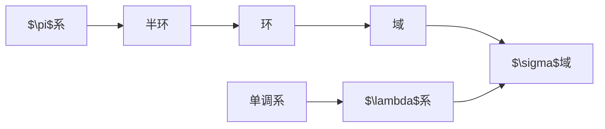

# 集合系

对于集合 $\Omega$ （将其称为**空间**），将其若干子集构成的集合称为集合系，记为 $\mathcal{C} \in \mathcal{P}(\Omega)$。

## 集合系的封闭性

若集合系中的任意集合在经某种特定操作后所得的集合仍然属于此集合系，则称集合系对这种操作**封闭**。常见的操作为：

+ 有限并：有限个集合的并集
+ 可列并：可列个集合的并集
+ 任意并：任意个集合的并集
+ 有限交：有限个集合的交集
+ 可数交：可列个集合的交集
+ 任意交：任意个集合的交集
+ 补：集合的补集
+ 单调极限：单调集合序列的极限[[集合的极限]]

在概率模型中，事件可以抽象为样本空间的子集，所有可能的事件对应着一个集合系。我们可以将简单的事件经过一系列操作后，得到复杂的事件，并以此为基础对其展开分析。这些事件的操作同时也对应着集合的操作，集合系的封闭性可以保证操作可以进行。

## 常见集合系

记实数域上由左半轴全体组成的集合系为
$$ \mathscr{P}_{\mathbb{R}} := \{ (-\infty,a]:a \in \mathbb{R} \} $$

记实数域上由左开右闭区间全体组成的集合系为
$$ \mathscr{Q}_{\mathbb{R}} := \{ (a,b]:a,b \in \mathbb{R} \} $$

### 单调系

如果对集合系 $\mathscr{M}$ 中的任何单调序列 ${A_{n},n=1,2, …}$ 均有 $\lim_{ n \to \infty }A_{n} \in \mathscr{M}$，则称 $\mathscr{M}$ 为单调系。

### 域（代数）

若非空集合系对*有限并、有限交、补*运算封闭，则称其为**域**(field)，或**代数**(algebra)。

这个定义可以将有限并（或有限交）换为包含空间。

在原定义下，只需将其中的集合与其补集并起来即可得到空间。若只规定包含空间，有限并封闭，补封闭，则由对偶律可知其也对有限交封闭。

### 集合系间的关系

$\sigma$ 域是域

设 $\mathscr{F}$ 是一个 $\sigma$ 域，则其对补运算封闭。再由其对可列并封闭可得
$$ A_{n} \in m\mathscr{F} \implies \bigcap_{n=1}^{\infty}=\{ \bigcup_{n=1}^{\infty} A_{n}^{\complement} \}^{\complement} \in \mathscr{F} $$
故 $\sigma$ 域对可列交也是封闭的。由于 $X \in \mathscr{F}$，故：
$$ A,B \in \mathscr{F} \implies A \cap B = A \cap B \cap X \cap \cdots \in \mathscr{F} $$
即其对交运算封闭。综上，$\sigma$ 域是域。

$\lambda$ 系是单调系；$\sigma$ 域是 $\lambda$ 系。

设 $\mathscr{L}$ 是 $\lambda$ 系，$\{ A_n \in \mathscr{L} \}$ 为单调集合。若 $A_n \uparrow$，则由 $\lambda$ 系的性质三可得
$$\lim_{ n \to \infty }A_n = \bigcup_{n=1}^{\infty} A_n \in \mathscr{L}$$
若 $A_n \downarrow$，则
$$\lim_{ n \to \infty }A_n = \bigcap_{n=1}^{\infty} A_n = \{ \bigcup_{n=1}^{\infty} A_{n}^{\complement} \}^{\complement} \in \mathscr{L}$$
综上，$\lambda$ 系是单调系。

设 $\mathscr{F}$ 是 $\sigma$ 域，$A,B \in \mathscr{F}$ 且 $B \subseteq A$。易知 $\sigma$ 域满足 $\lambda$ 系的性质一与性质三。又因为
$$A \setminus B = A \cap B^{\complement}=\{ A ^{\complement} \cup B \}^{\complement} \in \mathscr{F}$$
故，$\sigma$ 域是 $\lambda$ 系。

总结以上的讨论，我们得到了所定义的七个集合系之间由宽松到严紧的下列顺序：

|             |    交    |       并       |          差          |     补      |    空间     |    极限     |
|:-----------:|:--------:|:--------------:|:--------------------:|:-----------:|:-----------:|:-----------:|
|   $\pi$ 系   | ==有限== |                |                      |             |             |             |
|    半环     | ==有限== |                | ==真差可被有限覆盖== |             |             |             |
|     环      |   有限   |    ==有限==    |     $\surd$       |             |             |             |
|     域      | ==有限== |      有限      |       $\surd$        | == $\surd$ == | == $\surd$ == |             |
|   单调系    |          |                |                      |             |             | == $\surd$ == |
| $\lambda$ 系 |          | ==非降时可列== |       ==真差==       |   $\surd$   | == $\surd$ == |   $\surd$   |
| $\sigma$ 域  |   可列   |    ==可列==    |       $\surd$        | == $\surd$ == | == $\surd$ == |   $\surd$   |

这些集合系的核心是 $\sigma$ 域；它的成员就是我们常说的可测集。换旬话说，我们最终是要在 $\sigma$ 域上建立测度。非空集合 $X$ 和它上面的一个 $\sigma$ 域 $\mathscr{F}$ 放在一起写成的 $(X,\mathscr{F})$ 将称为可测空间。

一个既是单调系又是域的集合系必是 $\sigma$ 域。由表格易知，若域满足可列并封闭，则为 $\sigma$ 域。设域 $\mathscr{F}$ 为单调系，则对其中的可列个集合序列 $\{ A_n \in \mathscr{F} \}$ 有：
$$ \begin{align}
 &\bigcup_{k=1}^{n}A_k \in \mathscr{F} ,\ n = 1,2,\cdots  \\
\implies &\bigcup_{n=1}^{\infty} A_n=\bigcup_{n=1}^{\infty} \bigcup_{k=1}^{n}A_k = \lim_{ n \to \infty } \bigcup_{k=1}^{n}A_k \in \mathscr{F}
\end{align} $$
即 $\mathscr{F}$ 可列并运算封闭，故 $\mathscr{F}$ 是 $\sigma$ 域。

一个既是 $\lambda$ 系又是 $\pi$ 系的集合系必是 $\sigma$ 域。

记此集合系为 $\mathscr{F}$，由表可知，$\mathscr{F}$ 为一域。又因为 $\lambda$ 系是单调系，由上一命题可知，$\mathscr{F}$ 为 $\sigma$ 域。
